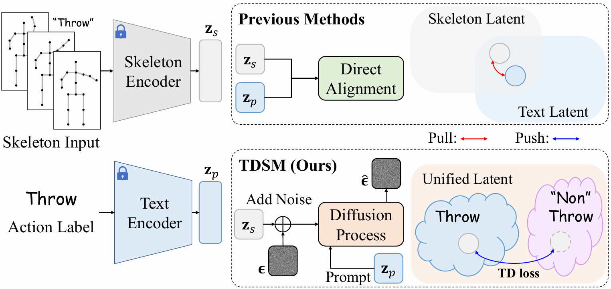
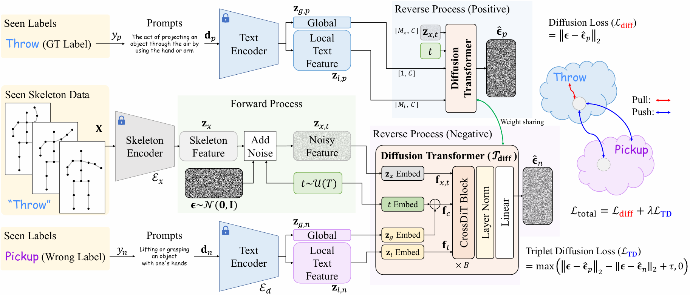

<div align="center">
<h2>[ICCV 2025] Bridging the Skeleton-Text Modality Gap: Diffusion-Powered Modality Alignment for Zero-shot Skeleton-based Action Recognition</h2>

<div>    
    <a href='https://sites.google.com/view/jeonghyeokdo/' target='_blank'>Jeonghyeok Do</a><sup>1</sup>&nbsp&nbsp&nbsp&nbsp;
    <a href='https://www.viclab.kaist.ac.kr/' target='_blank'>Munchurl Kim</a><sup>†1</sup>
</div>
<br>
<div>
    <sup>†</sup>Corresponding author</span>
</div>
<div>
    <sup>1</sup>Korea Advanced Institute of Science and Technology, South Korea</span>
</div>

<div>
    <h4 align="center">
        <a href="https://kaist-viclab.github.io/TDSM_site/" target='_blank'>
        
        </a>
        <a href="https://[TDSM_site](../../../%EB%B0%95%EC%82%AC%205%ED%95%99%EB%85%84%20%EB%B4%84%ED%95%99%EA%B8%B0/site/kaist-viclab.github.io/TDSM_site)arxiv.org/abs/2411.10745" target='_blank'>
        
        </a>
        </a>
        <a href="https://youtu.be/QD8Kbo6Eh1I" target='_blank'>
        
        </a>
        
    </h4>
</div>
</div>

---

<h4>
This repository is the official PyTorch implementation of "Bridging the Skeleton-Text Modality Gap: Diffusion-Powered Modality Alignment for Zero-shot Skeleton-based Action Recognition." Our approach, Triplet
 Diffusion for Skeleton-Text Matching (TDSM), outperforms the very recent state-of-the-art zero-shot skeleton-based action recognition methods with large margins, demonstrating superior accuracy and scalability in zero-shot settings through effective skeleton-text matching.
</h4>



## Network Architecture


---

## 📧 News
- **Jul 24, 2025:** Youtube video about TDSM is uploaded :sparkles:
- **Jul 21, 2025:** Codes of TDSM are released :fire:
- **Jun 26, 2025:** TDSM accepted to ICCV 2025 :tada:
- **Nov 16, 2024:** This repository is created

---
## Reference
```BibTeX
@inproceedings{do2025bridging,
  title={Bridging the Skeleton-Text Modality Gap: Diffusion-Powered Modality Alignment for Zero-shot Skeleton-based Action Recognition},
  author={Do, Jeonghyeok and Kim, Munchurl},
  booktitle={Proceedings of the IEEE/CVF international conference on computer vision},
  year={2025}
}
```
---

## Contents
- [Requirements](#requirements)
- [Data Preparation](#data-preparation)
- [Training](#training)
- [Results](#results)
- [License](#license)
- [Acknowledgement](#acknowledgement)

---

## ⚙️ Requirements
> - Python >= 3.9.19
> - PyTorch >= 2.4.0
> - Platforms: Ubuntu 22.04, CUDA 11.8
> - We have included a dependency file for our experimental environment. To install all dependencies, create a new Anaconda virtual environment and execute the provided file. Run `conda env create -f requirements.yaml`.

## 📁 Data Preparation

We follow the evaluation setup from [SynSE](https://github.com/skelemoa/synse-zsl), [PURLS](https://github.com/azzh1/PURLS), and [SMIE](https://github.com/YujieOuO/SMIE).

Download the **pre-extracted skeleton features** (for SynSE and SMIE settings) and **class descriptions** from [SA-DVAE](https://github.com/pha123661/SA-DVAE).
Then, arrange them as follows:

```bash
data
  ├──sk_feats
  │   ├── shift_ntu60_5_r
  │   ├── shift_ntu60_12_r
  │   ├── shift_ntu60_20_r
  │   ├── shift_ntu60_30_r
  │   ├── shift_ntu120_10_r
  │   ├── shift_ntu120_24_r
  │   ├── shift_ntu120_40_r
  │   └── shift_ntu120_60_r
  │
  ├──label_splits
  └──class_lists
      ├── ntu60.csv
      ├── ntu60_llm.txt
      ├── ntu120.csv
      └── ntu120_llm.txt
```
> **Note:** Pre-extracted skeleton features for the PURLS settings are not provided. Therefore, we extracted the skeleton features ourselves using the official [Shift-GCN](https://github.com/kchengiva/Shift-GCN) code.

## Training
```bash
# Download code
git clone https://github.com/KAIST-VICLab/TDSM
cd TDSM

# Train TDSM on SynSE benchmarks for the NTU-60 dataset (55/5 split)
python main.py --config ./config/tdsm_ntu60_unseen5.yaml

# Train TDSM on SynSE benchmarks for the NTU-60 dataset (48/12 split)
python main.py --config ./config/tdsm_ntu60_unseen12.yaml

# Train TDSM on SynSE benchmarks for the NTU-120 dataset (110/10 split)
python main.py --config ./config/tdsm_ntu120_unseen10.yaml

# Train TDSM on SynSE benchmarks for the NTU-120 dataset (96/24 split)
python main.py --config ./config/tdsm_ntu120_unseen24.yaml

# Train TDSM on PURLS benchmarks for the NTU-60 dataset (40/20 split)
python main.py --config ./config/tdsm_ntu60_unseen20.yaml

# Train TDSM on PURLS benchmarks for the NTU-60 dataset (30/30 split)
python main.py --config ./config/tdsm_ntu60_unseen30.yaml

# Train TDSM on PURLS benchmarks for the NTU-120 dataset (80/40 split)
python main.py --config ./config/tdsm_ntu120_unseen40.yaml

# Train TDSM on PURLS benchmarks for the NTU-120 dataset (60/60 split)
python main.py --config ./config/tdsm_ntu120_unseen60.yaml
```

## Results
Please visit our [project page](https://kaist-viclab.github.io/TDSM_site/) for more experimental results.

## License
The source codes can be freely used for research and education only. Any commercial use should get formal permission from the principal investigator (Prof. Munchurl Kim, mkimee@kaist.ac.kr).

## Acknowledgement
This repository is built upon [SkateFormer](https://github.com/KAIST-VICLab/SkateFormer).